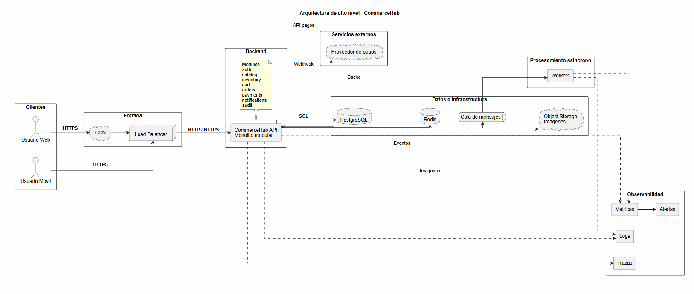
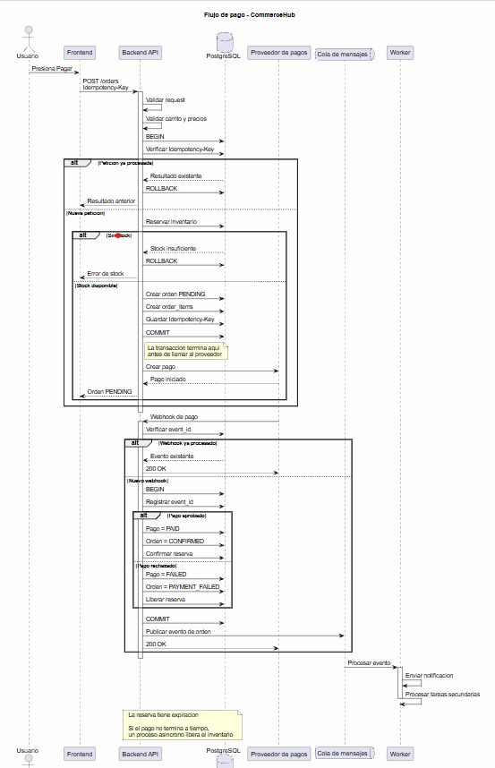

# 2. Arquitectura

## 2.1 Arquitectura de alto nivel

Partiria de un monolito modular
La idea es mantener una sola aplicacion backend, pero con limites internos claros por dominio

Para la carga inicial esperada no empezaria con microservicios
1000 requests por segundo no obliga por si solo a dividir el sistema
La complejidad operacional de microservicios podria ser mas costosa que el beneficio inicial

La API debe ser stateless
Esto permite ejecutar varias instancias detras de un Load Balancer



Los clientes web y movil consumen la API por HTTPS
El CDN entrega imagenes y contenido estatico sin pasar por la API

El Load Balancer distribuye trafico entre varias instancias de la API
La API concentra la logica de negocio y organiza los modulos internos

PostgreSQL es la fuente principal de verdad para datos transaccionales
Ahi vivirian usuarios, tiendas, productos, ordenes, inventario, reservas, pagos, idempotencia y webhooks procesados

Redis se usaria para cache, rate limiting y datos temporales cuando tenga sentido
No lo usaria como fuente principal de verdad para inventario

La cola permite sacar del request principal tareas lentas o reintentables
Los workers procesan notificaciones, emails y tareas secundarias

Object Storage guarda imagenes de productos
El proveedor de pagos se integra por API y confirma resultados mediante webhook

La observabilidad debe cubrir logs, metricas, trazas y alertas

## 2.2 Flujo completo al pagar

El flujo de pago debe evitar cobros duplicados y overselling
Tambien debe asumir que el proveedor externo puede responder lento



1. El frontend envia la solicitud con Idempotency-Key
2. El backend valida el request
3. El backend valida carrito y precios
4. Se verifica si la clave de idempotencia ya fue procesada
5. Se reserva inventario
6. Se crea una orden en estado PENDING
7. Se guardan items e idempotencia
8. Se hace COMMIT
9. Despues del commit se llama al proveedor de pagos
10. La transaccion de PostgreSQL no queda abierta esperando al proveedor
11. El proveedor envia un webhook con el resultado
12. Se valida que el webhook no haya sido procesado antes
13. Si el pago fue aprobado se confirma pago, orden y reserva
14. Si fue rechazado se marca como fallido y se libera la reserva
15. Se publica un evento en la cola
16. Un worker procesa notificaciones y tareas secundarias

La reserva de inventario tiene expiracion
Si el pago nunca termina, un proceso asincrono puede liberar la reserva

## 2.3 Componentes y responsabilidades

API:
endpoints y logica de negocio

PostgreSQL:
datos transaccionales y consistencia

Redis:
cache, rate limiting y datos temporales

Queue:
desacopla procesamiento asincrono

Workers:
procesan tareas fuera del request principal

Object Storage:
almacenamiento de imagenes

CDN:
distribucion de contenido estatico

Proveedor de pagos:
procesamiento externo y confirmacion por webhook

Observabilidad:
logs, metricas, trazas y alertas

## 2.4 Consistencia

Algunas operaciones necesitan consistencia fuerte
Otras pueden ser eventuales sin afectar la compra

Consistencia fuerte:

- inventario
- reservas
- creacion de orden
- cambios validos de estado de la orden
- estado del pago recibido por webhook
- idempotencia

Estas partes definen si una compra existe, si el stock esta reservado y si el pago fue aplicado
No deberian depender de procesos diferidos

Consistencia eventual:

- notificaciones
- emails
- cache
- analytics
- busqueda si en el futuro se separa
- procesos secundarios de auditoria que no sean necesarios para completar la transaccion

Estas tareas pueden ejecutarse despues
Si fallan, se pueden reintentar sin romper la operacion principal

## 2.5 Overselling

El inventario no debe quedar negativo
La reserva debe hacerse con una operacion atomica en PostgreSQL

Un ejemplo simple seria:

```sql
UPDATE inventory
SET available_quantity = available_quantity - $2
WHERE sku = $1
  AND available_quantity >= $2;
```

Despues se revisa el numero de filas afectadas
Si no se actualizo ninguna fila, no habia stock suficiente

La reserva y la creacion de la orden deben ejecutarse dentro de la misma transaccion
Si cualquier parte falla se hace rollback

Otra opcion es usar SELECT ... FOR UPDATE dependiendo del flujo
La idea es bloquear o actualizar de forma segura el registro que representa el stock

Redis no deberia controlar el stock como fuente de verdad
Las reservas deben tener expiracion
Si el pago no se completa, una tarea asincrona puede liberar la reserva

## 2.6 Idempotencia y duplicados

### Solicitudes duplicadas del cliente

El cliente debe enviar Idempotency-Key al iniciar el pago
La clave debe tener una restriccion UNIQUE y quedar asociada a la operacion creada

Si la misma clave llega otra vez se devuelve el resultado de la operacion existente
No se crea otra orden

### Cobros duplicados

Al llamar al proveedor de pagos se debe reutilizar la misma referencia idempotente si el proveedor lo soporta
No se debe iniciar un segundo cobro para la misma operacion

### Webhooks duplicados

El proveedor puede enviar el mismo webhook mas de una vez
El sistema debe guardar el identificador unico del evento recibido

Ese identificador debe tener una restriccion UNIQUE
Si el evento ya fue procesado, se responde correctamente sin ejecutar otra vez la logica

Las transiciones de estado tambien deben ser idempotentes
Por ejemplo, una orden ya pagada no deberia volver a aplicar el mismo pago

## 2.7 Escalabilidad y disponibilidad

La API debe ser stateless
Asi puede correr en multiples instancias detras de un Load Balancer

El Load Balancer debe usar health checks
Las instancias sanas reciben trafico
Las instancias con fallos se sacan del balanceo

El escalado horizontal permite agregar mas instancias de API cuando aumenta la carga
PostgreSQL deberia ser administrado o tener una estrategia equivalente de alta disponibilidad

Los backups son necesarios, pero no suficientes para 99.9%
Tambien hay que probar periodicamente que se pueden restaurar
Tambien definiria objetivos de recuperacion como RPO y RTO y los validaria mediante pruebas de restauracion

Las replicas de lectura pueden agregarse si el patron real de lectura lo justifica
No las pondria como requisito desde el inicio

Las dependencias externas deben tener timeouts
Los retries deben tener limites
Los mensajes que fallen repetidamente deberian ir a una dead letter queue

Las metricas y alertas deben cubrir disponibilidad, latencia, errores y fallos de procesos importantes
No se debe prometer disponibilidad absoluta

## 2.8 Monolito modular vs servicios separados

Inicialmente usaria un monolito modular

Razones:

- menos complejidad operacional
- transacciones mas faciles
- despliegue mas simple
- observabilidad mas sencilla
- 1000 rps no obliga por si solo a usar microservicios

Algunos modulos podrian separarse despues si aparece una necesidad real

Notifications:
si aumenta mucho el volumen asincrono

Payments:
si requiere aislamiento, despliegues independientes o multiples proveedores

Catalog/Search:
si el volumen de lectura o las necesidades de busqueda requieren escalar de forma diferente

La separacion se haria por una necesidad medida
No desde el inicio

## 2.9 Eleccion de infraestructura

Mantendria el diseño cloud agnostic
Se pueden usar servicios administrados equivalentes en AWS, Azure o GCP

1. Monolito modular
   Reduce complejidad inicial y mantiene limites claros entre dominios

2. PostgreSQL
   Sirve para ordenes, inventario, pagos y operaciones que requieren transacciones

3. Redis
   Es util para cache y rate limiting sin convertirlo en fuente de verdad del inventario

4. Cola de mensajes
   Permite sacar tareas lentas o reintentables del request principal

5. Object Storage + CDN
   Evita servir imagenes directamente desde la API y permite escalar contenido estatico

## 2.10 Seguridad

La arquitectura debe cubrir al menos los siguientes controles

- autenticacion
- autorizacion por roles
- HTTPS
- validacion de entrada
- secretos fuera del codigo fuente
- credenciales con minimo privilegio
- auditoria de operaciones sensibles
- rate limiting
- validacion de autenticidad de webhooks
- no guardar informacion sensible de tarjetas si el proveedor permite tokenizacion

## 2.11 Operacion y observabilidad

Logs:
estructurados y con request id o correlation id

Metricas:
latencia, errores, throughput, uso de recursos, pagos fallidos y reservas expiradas

Trazas:
permiten seguir una operacion entre API, base de datos, proveedor de pagos y procesos asincronos

Alertas:
basadas en errores, latencia, disponibilidad y fallos de procesos importantes

CI/CD debe permitir despliegues repetibles
Rollback debe estar previsto para volver rapido a una version estable si algo falla
