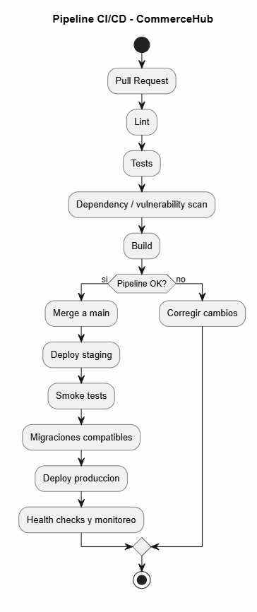

# 6. DevOps y operacion

## 6.1 Pipeline CI/CD



En cada Pull Request ejecutaria:

- lint
- tests
- analisis de dependencias
- build

Si algo falla, se corrige antes del merge
No se hace merge con el pipeline fallando

Despues del merge:

```text
Deploy staging
Smoke tests
Migraciones compatibles
Deploy produccion
Health checks y monitoreo
```

La misma version validada debe ser la que llega a produccion

Las migraciones deben mantener compatibilidad con la version anterior
Los cambios destructivos se dejan para un despliegue posterior

## 6.2 Rollback

Si una version presenta problemas, volveria al artefacto anterior estable

```text
detener despliegue
volver a version anterior
verificar health checks y metricas
```

No recompilaria durante rollback
Usaria una version anterior ya validada

Las migraciones compatibles hacen mas seguro volver atras

Ejemplos de motivos:

- errores 5xx altos
- checkout fallando
- health checks fallando

## 6.3 Secretos y credenciales

No guardaria secretos en Git ni en el codigo

Usaria:

```text
secret manager
variables seguras del sistema CI/CD
```

Ejemplos:

```text
DATABASE_URL
credenciales del proveedor de pagos
secret de webhooks
```

Aplicaria minimo privilegio
No imprimiria secretos en logs

## 6.4 Metricas y alertas

Metricas principales:

- latencia y errores 5xx
- ordenes creadas
- errores de stock
- ordenes PENDING_PAYMENT
- timeouts del proveedor
- webhooks fallidos
- reservas expiradas

Alertas:

- aumento de errores
- latencia alta del checkout
- muchos timeouts de pagos
- acumulacion de ordenes pendientes
- health checks fallando

No inventaria thresholds fijos
Los valores reales se ajustan segun el comportamiento normal del sistema

Los logs deben permitir relacionar request_id, order_id, idempotency_key y provider_payment_id
